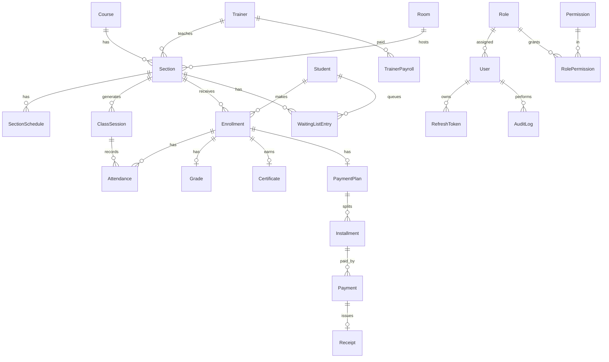

# ERD

## Conventions
- `Id`: auto-increment `int`.
- `BaseEntity`: `CreatedAt`, `UpdatedAt`, `IsDeleted`.
- Without `BaseEntity`: `SectionSchedule`, `RefreshToken`, `Permission`, `RolePermission`, `AuditLog`, `Setting`.
- Money: `decimal`. USD payments store `ExchangeRate` and `AmountInSyp` at entry time.
- Financial data is never hard-deleted (status change only).
- `Installment` overdue state and the student's remaining balance are computed, not stored.
